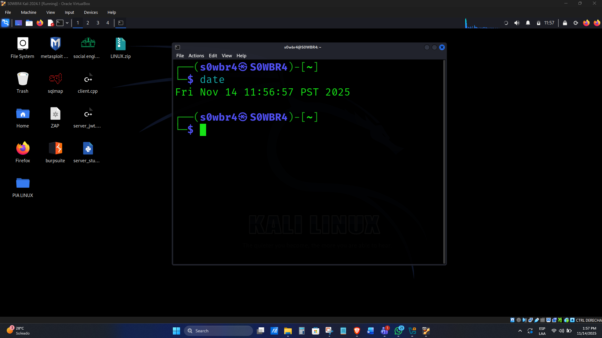

Pruebas y Evidencias  

##1.Snapshot previo de la VM
Esta captura muestra el estado de la máquina virtual antes de ejecutar el binario, con la fecha y hora visible.

=====

##2.Ejecución del binario en la VM
Se compila y ejecuta el binario dentro de la máquina virtual Linux y la salida del programa lo muestra en la consola. 
/evidence/ejecucion de binario.jpeg)
##Comandos ejecutados:
g++ server_jwt.cpp -o servidor
./servidor

=====

##3.Analisis estatico del binario (Ghidra)
Se identifico de manera correcta la función del binario main, donde se pueden observar las variables locales, asignaciones y las funciones llamadas como sale ahi, "cargarUsuarios" y manejo de http
/evidence/funcion main en ghidra.png)
En el análisis se pudo generar el archivo .gar y proyecto Dhidra completo que se guardo en:
/analysis/AnalisisServidor_2025_11_14.gar

=====

##4.Archivos de análisis incluidos
En la carpeta con el nombre "analysis" podemos ver los archivos "AnalisisServidor.gpr", "AnalisisServidor.rep" y el archivo que fue exportar .gar.
Estos archivos son del análisis estático que se hizo.

=====

##5.Archivos fuente incluidos
En el directorio de "source" tenemos los códigos fuente originales tanto para la maquina Linux que se uso como servidor en el proyecto, como para la maquina windows que se uso como cliente.
Estos archivos se encuentran como "PIA LINUX" y "W10"
